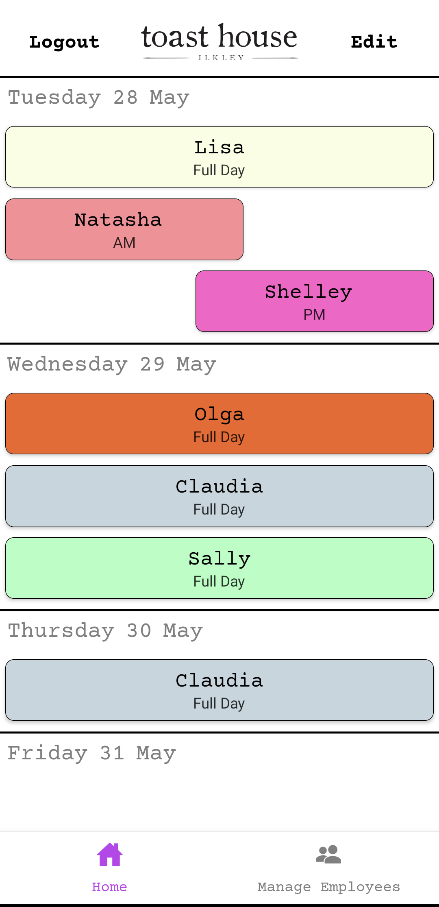
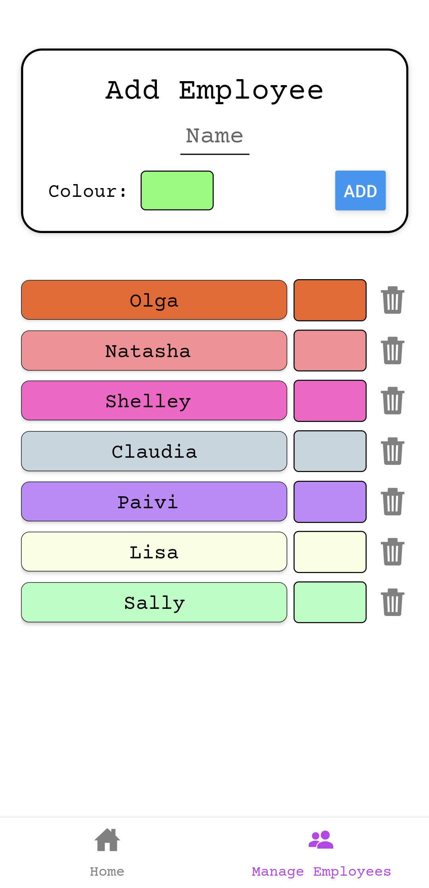
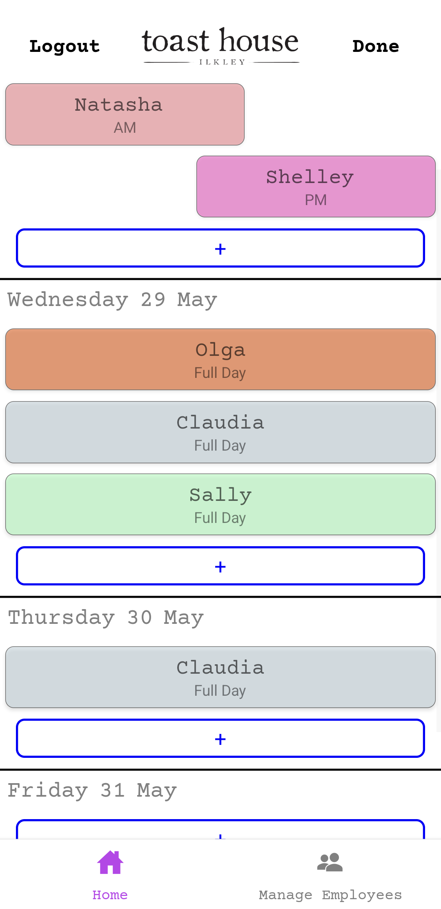
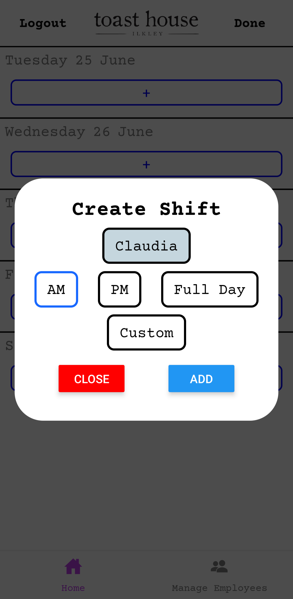

# Toast House Rota

This is an application made for [Toast House Ikley](http://www.toasthouse.co.uk/). The app provides a platform for the Toast House leadership to publish the upcoming Rotas into a simple and efficeint format for employees to easily access. Built with React Native for fast development across Android and IOS

# Screenshots

  
  
  
  

